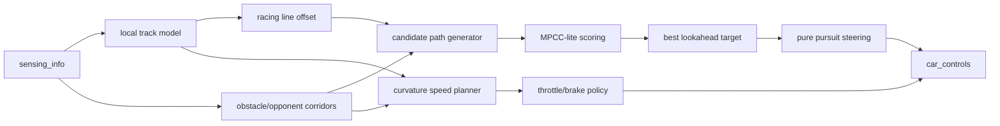

# SSAFY Race FAST Strategy

작성일: 2026-06-14

## 1. 목표 재정의

SSAFY Race의 현재 로컬 검증 목표는 `무충돌`이 아니라 `완주 시간 최소화`다.

- 1순위: `RaceComplete`까지의 실제 `elapsed` 최소화
- 2순위: 완주 실패, 장기 stuck, 역주행 루프 방지
- 3순위: 충돌/도로 이탈/브레이크 페널티 최소화

충돌과 페널티는 금지 조건이 아니라 시간 손실 비용이다. 즉 장애물을 크게 피해서 4초를 잃는 것보다, 접촉 후 1초 손실로 계속 가는 쪽이 빠르면 접촉을 허용한다.

현재 Map31 실제 검증 기준:

| 후보 | elapsed | 충돌 | 페널티 | 판정 |
| --- | ---: | ---: | ---: | --- |
| current `No-but ssafy_final` no-log | 155.02s | 12 | 12 | 현재 베스트 |
| `No-but ssafy_final` 원본 | 155.59s | 7 | 14 | 근접 2위 |
| `windy825 ssafy2` | 168.28s | 22 | 92 | 빠르지만 손실 큼 |
| 이전 무충돌 안정판 | 261.20s | 0 | 0 | 목표 기준 오류 |

## 2. SSAFY 제약에 맞춘 핵심 전략

### A. Racing Line 생성

일반 레이싱 라인은 중심선이 아니라 `outside -> apex -> outside`다. SSAFY는 실제 waypoint 좌표를 사용자 코드에서 직접 받지 못하므로 `track_forward_angles`, `distance_to_way_points`, `to_middle`, `lap_progress`로 가짜 로컬 centerline을 만든다.

로컬 곡률 근사:

```text
curve_near  = weighted(track_forward_angles[0:4])
curve_mid   = weighted(track_forward_angles[3:8])
curve_far   = weighted(track_forward_angles[8:14])
curve_abs   = max(abs(curve_near), 0.8 * abs(curve_mid), 0.55 * abs(curve_far))
curve_dir   = sign(curve_mid or curve_near)
```

목표 lateral offset:

```text
if 직선:
    racing_offset = 0 또는 다음 장애물 통로
elif 코너 진입:
    racing_offset = -curve_dir * outside_width
elif apex 근처:
    racing_offset =  curve_dir * apex_width
elif 코너 탈출:
    racing_offset = -curve_dir * exit_width
```

단, Map31처럼 장애물 맵에서는 “이론적 apex”보다 “다음 장애물 통과 후 가속 가능한 선”이 우선이다.

### B. Pure Pursuit 라인 추종

Pure Pursuit는 차 앞 일정 거리의 목표점을 잡고 그 점을 쫓는다. SSAFY에서는 실제 좌표 대신 `lookahead_dist`에서의 목표 `to_middle`을 쫓는다.

속도별 lookahead:

```text
base_lookahead = clamp(35 + speed * 0.55, 45, 125)
if 장애물 밀집: base_lookahead -= 10~25
if steering 진동/zigzag: base_lookahead += 10~20
if 급회피 직전: near_target도 함께 사용
```

조향 근사:

```text
target_heading = atan2(target_middle - to_middle, lookahead_dist)
steering = (target_heading_deg - moving_angle) / steer_factor
steering += near_target_correction
steering = rate_limit(steering, previous_steering, speed)
```

핵심은 고속일수록 멀리 보고, 장애물이 가까울 때만 짧게 보는 것이다. 고속에서 가까운 점만 쫓으면 지그재그가 생긴다.

### C. 속도 계획

공식 물리값 `mu`를 알 수 없으므로 `sqrt(mu*g*r)`를 직접 쓰기보다 곡률 기반 목표속도 표로 근사한다.

```text
curve_abs < 3    -> target_speed 185~195
curve_abs < 7    -> target_speed 165~180
curve_abs < 15   -> target_speed 135~155
curve_abs < 25   -> target_speed 105~130
curve_abs < 35   -> target_speed 85~110
else             -> target_speed 65~90
```

장애물이 없고 heading error가 작으면 풀가속한다.

```text
if no_obstacle and abs(moving_angle) < 8 and edge_ratio < 0.65:
    throttle = 1.0
    brake = 0.0
```

장애물이 있으면 “피할지/박을지”를 시간 비용으로 결정한다.

### D. 장애물 회피는 후보 경로 scoring

장애물은 단일 if문으로 피하지 않는다. lateral 후보를 만들고 비용함수로 고른다.

후보:

```text
lanes = [-limit, ..., 0, ..., +limit]  # 0.5m 또는 0.7m 간격
horizon = [20m, 45m, 80m, 125m]
candidate_path = lane sequence over horizon
```

비용:

```text
J =
  - progress_reward
  + edge_cost
  + steering_delta_cost
  + speed_loss_cost
  + obstacle_clearance_cost
  + future_connection_cost
  + controlled_contact_cost
```

중요한 점은 `obstacle_clearance_cost`를 무한대로 두지 않는 것이다.

```text
if collision_predicted:
    controlled_contact_cost = estimated_recovery_time
```

즉 회피가 너무 큰 S자 라인을 만들면, 살짝 접촉하고 직선 가속을 유지하는 후보가 이길 수 있다.

### E. MPCC-lite 후보 경로 scoring

진짜 MPCC는 차량 모델과 최적화기가 필요해서 SSAFY Python 0.1초 루프에는 과하다. 대신 매 tick 5~9개 후보만 평가한다.

후보 예시:

```text
candidate_offsets = [
    racing_offset,
    current_lane,
    center,
    left_gap,
    right_gap,
    far_left_fast,
    far_right_fast,
]
```

목적함수:

```text
score =
  time_loss_estimate
  + 0.8 * steering_jerk
  + 1.2 * edge_penalty_risk
  + 0.6 * future_obstacle_block
  + 0.4 * deviation_from_racing_line
  + contact_time_cost
```

`contact_time_cost`는 0이 아니다. 다만 무한대도 아니다.

```text
if obstacle_gap < 1.8:
    contact_time_cost = 1.5~4.0 seconds equivalent
if contact causes reverse/stuck likely:
    contact_time_cost = 12~30 seconds equivalent
```

## 3. 실제 코드 구조



## 4. 현재 베스트 코드와의 차이

현재 베스트 `ssafy_final`은 이미 빠르다. 이유는 다음과 같다.

- 장애물 회피를 완전 무충돌로 강제하지 않는다.
- 목표 속도가 높다. 직선에서 160km/h 이상까지 간다.
- 구간별 hardcoding으로 사고가 큰 곳만 눌러준다.
- recovery가 있어 충돌 후에도 완주한다.

다만 약점도 명확하다.

- `lap_progress` hardcoding이 많아 맵 일반화가 약하다.
- racing line이 곡률 기반 outside/apex/outside라기보다 장애물 후보선 중심이다.
- 후보 경로의 “접촉해도 빠른지” 비용 계산이 명시적이지 않다.
- Pure Pursuit라기보다 각도 기반 proportional steering에 가깝다.

## 5. 다음 구현 방향

### Step 1. 현재 베스트 보존

현재 제출본은 유지한다.

```text
work/Template_Python/Bot_Python/my_car.py
submissions/my_car.py
```

이 파일은 Map31 기준 `155.02s` 검증본이다.

### Step 2. 새 실험 브랜치 알고리즘

현재 코드 위에 바로 다 갈아엎지 말고, `control_driving` 앞쪽에 Map31 전용 `mpcc_lite_map31()`을 작게 붙인다.

핵심 함수:

```python
def build_racing_offset(angles, speed, to_middle, half_limit):
    ...

def build_lane_candidates(obstacles, racing_offset, to_middle, half_limit):
    ...

def score_candidate(candidate, obstacles, speed, angles, to_middle, prev_steering):
    ...

def pure_pursuit_control(target_middle, lookahead, moving_angle, speed):
    ...
```

### Step 3. 검증 기준

채택 기준:

```text
1. 완주해야 함.
2. elapsed < 155.02s 이면 채택.
3. collisions/penalties는 elapsed가 같을 때 tie-breaker.
4. 48~55%, 89~99% 구간에서 stuck loop가 생기면 즉시 폐기.
```

## 6. 실험 후보

| ID | 변경 | 기대 | 폐기 조건 |
| --- | --- | --- | --- |
| F01 | 현재 `ssafy_final` + Pure Pursuit lookahead만 교체 | 지그재그 감소, 속도 유지 | 155초 초과 |
| F02 | obstacle clearance 무한대 제거, controlled contact cost 도입 | 회피 S자 손실 감소 | 48% stuck 증가 |
| F03 | outside/apex/outside offset 추가 | 코너 탈출속도 상승 | 페널티 급증 |
| F04 | speed planner를 curve/future_curve/heading_error 기반으로 교체 | 불필요한 brake 감소 | 충돌 후 recovery 증가 |
| F05 | Map31 gate cluster 전용 후보 path scoring | 48~55% 구간 단축 | 해당 구간 stuck |

## 7. 결론

가장 현실적인 새 전략은 풀 MPC가 아니라 `Racing line + Pure Pursuit + finite collision cost + MPCC-lite candidate scoring`이다.

SSAFY Race에서는 “안 부딪히는 경로”가 아니라 “부딪히더라도 더 빨리 완주하는 경로”를 고르는 비용함수가 맞다. 현재 베스트는 이미 그 방향에 가깝고, 다음 성능 개선은 장애물 회피를 명시적인 비용함수로 바꿔서 48~55%, 89~99%의 시간 손실 구간을 줄이는 것이다.
